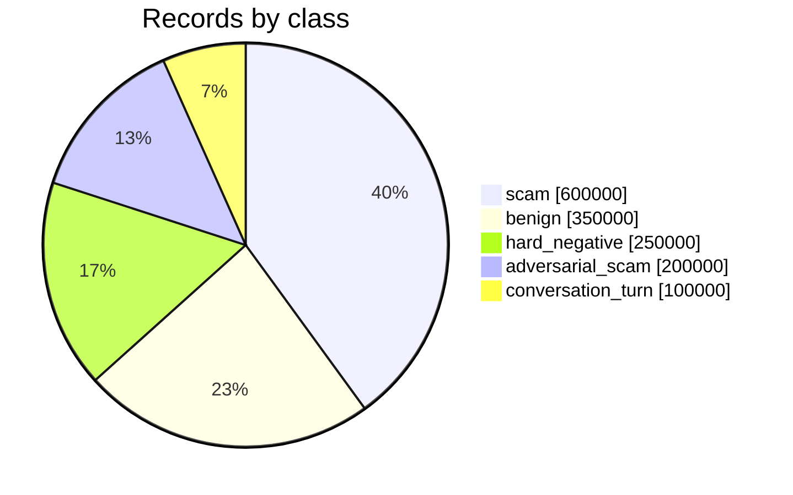
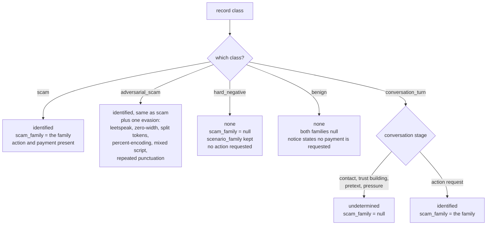
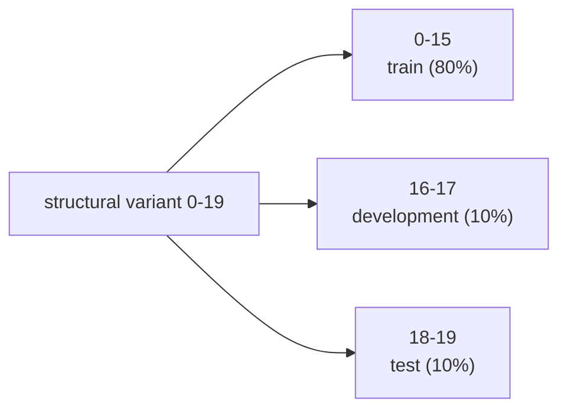
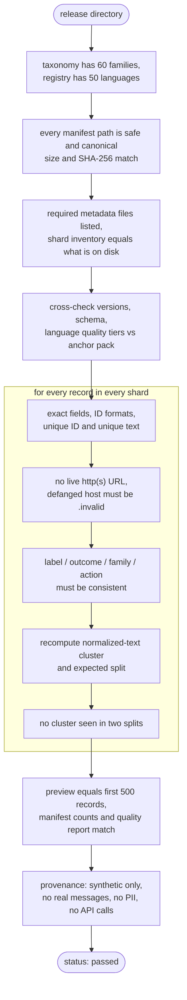

# NexVision ScamText Global

[](https://github.com/NexvisionLab/Global-Scam-Text-and-Smishing-Threat-Intelligence-Engine/actions/workflows/tests.yml)

NexVision ScamText Global is an offline, deterministic research dataset and
toolkit for multilingual scam-message taxonomy, robustness testing and detector
development. It covers SMS, WhatsApp-style messages, direct messages and short
conversation turns without calling an API or contacting the network.

Version 0.2.1 generates 1,500,000 synthetic records spanning 50 language
labels, 21 scripts and 60 scam families. It includes benign messages, hard
negatives, adversarial variants and staged conversations. This repository
contains the source, tests, rule data and documentation; generated bulk shards
are intentionally excluded from Git history.

> This is research data, not evidence of real-world detector accuracy. No
> language in v0.2.1 has completed native-speaker review. Do not use it as the
> sole basis for blocking, attribution or automated enforcement.

## What the project does

The project creates and validates labelled synthetic messages for developing
and testing scam-detection systems. It models scam families, observable action
anchors, benign and negated contexts, evasive spelling, conversation stages,
language metadata and leakage-resistant dataset splits.

It does **not** currently accept an arbitrary live message and calculate a scam
probability. It is the offline dataset and validation foundation for such a
checker. See [Features and analysis logic](docs/FEATURES_AND_ANALYSIS_LOGIC.md)
for the exact implemented workflow and current boundaries.

## Highlights

- Fully offline, Python standard-library-only generation and validation
- Deterministic output with file hashes and reproducible manifests
- Campaign-, template-, near-duplicate- and normalized-text-separated splits
- Anchor-based labels with explicit `identified`, `undetermined` and `none`
  outcomes
- Benign-context, negation and job/task-scam counterexamples
- Defanged reserved `.invalid` URLs and synthetic placeholders only
- Transactional output replacement and strict streaming validation
- 29 regression tests covering previously discovered defects and safe output handling,
  run in CI on Linux, Windows and macOS

## Repository contents

| Path | Purpose |
|---|---|
| `src/generate_dataset.py` | Deterministic offline generator |
| `src/validate_dataset.py` | Streaming integrity and semantic validator |
| `data/curated_anchor_packs.json` | Localized anchors for 18 languages |
| `tests/test_dataset.py` | Unit and regression test suite |
| `docs/DATASET_CARD.md` | Intended use, exclusions and limitations |
| `docs/DATA_DICTIONARY.md` | Record-field reference |
| `docs/ARCHITECTURE.md` | Data flow and trust boundaries |
| `docs/FEATURES_AND_ANALYSIS_LOGIC.md` | Features, label rules and validation logic |
| `docs/REPRODUCIBILITY.md` | Rebuild and verification procedure |
| `PUBLIC_RELEASE_REPORT.md` | Public security and release report |

## Requirements

- Python 3.11 or newer
- Approximately 1 GB of temporary disk space for the default release
- No third-party Python packages
- No API keys, accounts or network access

## Quick start

Run the tests:

```bash
python -m unittest discover -s tests -v
```

Generate and validate a smaller local research build:

```bash
python src/generate_dataset.py --output build/demo --records 15000 --shard-size 5000
python src/validate_dataset.py build/demo
```

The held-out splits only begin late in a build (development after 48,000
records, test after 54,000), so a 15,000-record demo is entirely `train` and the
generator prints a warning saying so. Use more than 54,000 records when you need
development and test data.

Generate the complete v0.2.1 release:

```bash
python src/generate_dataset.py --output build/v0.2.1 --records 1500000 --shard-size 100000
python src/validate_dataset.py build/v0.2.1
```

The generator writes gzip-compressed JSON Lines shards plus a schema,
taxonomy, language registry, provenance record, preview, quality report and
hash manifest. Generation is transactional: an incomplete build does not
replace a previously valid output directory.

## Analysis logic at a glance

Each synthetic message is built from a scam scenario, language seed or curated
anchor, structural variant, channel, lure and requested action. The label is
then assigned from the observable content—not merely from the generating
scenario:

| Message form | Outcome | Family exposed? |
|---|---|---:|
| Scam or adversarial scam with an action request | `identified` | Yes |
| Conversation before an action request | `undetermined` | No |
| Conversation containing the action request | `identified` | Yes |
| Benign service notice with explicit negation | `none` | No |
| Awareness/training hard negative | `none` | No |

`scenario_family` records the scenario used to construct a research example.
`scam_family` is populated only when the message itself contains sufficient
observable anchors. This distinction prevents benign warnings or early-stage
conversation messages from being presented as confirmed scam patterns.

## How it works

### Generation pipeline

`src/generate_dataset.py` builds a release in an isolated staging directory and
only swaps it into place once every step has succeeded, so a failed run never
damages a previous good release.

```mermaid
flowchart TD
    A(["--output, --records, --shard-size"]) --> B["guard the output path<br/>no filesystem root, no symlink,<br/>no non-empty directory it does not manage"]
    B --> C["load curated_anchor_packs.json<br/>check structure, licence, review status, 18 languages"]
    C --> D["build taxonomy (60 families)<br/>and language registry (50 languages)<br/>cardinality checks fail closed"]
    D --> D2["write taxonomy, language registry,<br/>schema and provenance"]
    D2 --> E["allocate the class mix exactly<br/>(largest-remainder, never negative)"]
    E --> F

    subgraph loop ["for every record"]
        F["pick language and family by position<br/>plus channel, brand, payment, lure,<br/>amount, deadline, URL path"] --> G["structural variant 0-19 sets the split and the<br/>campaign, template and near-duplicate IDs"]
        G --> H["choose the pretext:<br/>curated anchor (tier A) or generic (tier B)"]
        H --> I["render the message for its class<br/>adversarial records get one evasion"]
        I --> J["derive the normalized-text cluster ID from the text,<br/>check no cluster crosses a split, write the record"]
    end

    J --> K["gzip shards: fsync, re-read,<br/>count rows, then rename into place"]
    K --> L["write quality report,<br/>install the first-500 preview"]
    L --> M["manifest.json: counts plus<br/>size and SHA-256 of every file"]
    M --> N(["atomic swap of staging directory<br/>into the requested output"])
```



Class mix of the 1,500,000-record reference release:



### How a record gets its label

The class the generator is building decides the outcome, and a family is named
only when the finished message itself contains enough evidence to name it.



### Splits and leakage control

Every language-and-family campaign cycles through 20 structural variants, and
the variant alone decides the split, so related records can never straddle the
train/test boundary.



Four identifiers are tracked and each must map to exactly one split:
`campaign_id`, `template_cluster_id`, `near_duplicate_cluster_id` and
`normalized_text_cluster_id` (the text with URLs, numbers and reference codes
masked). The generator checks this while writing, and the validator rebuilds the
mapping independently.

### Validation pipeline

`src/validate_dataset.py` does not trust the manifest. It streams every record
and stops at the first inconsistency.



## Safety and privacy

The distributed source and synthetic records are designed not to contain real
credentials, phone numbers, account numbers or personal identities. Example
links use `hxxps` and bracketed `.invalid` hosts. Treat any future real-message
contribution as sensitive: do not open a public issue containing a suspicious
message, identifier or victim data. See [SECURITY.md](SECURITY.md).

## Validation status

The v0.2.1 reference build passed full streaming validation over 1,500,000
records, all 29 regression tests (one skips where the OS forbids symbolic links)
and offline security/privacy scans. It has no
known runtime dependency vulnerabilities because generation and validation use
only the supported Python standard library. Remaining research limitations are
listed in [PUBLIC_RELEASE_REPORT.md](PUBLIC_RELEASE_REPORT.md).

## Contributing

Read [CONTRIBUTING.md](CONTRIBUTING.md) before proposing rule, taxonomy or
language changes. Language contributions require provenance, licence metadata
and native-review status; real scam messages must not be committed.

## Licence

Copyright © 2026 NexVision Lab.

This project is source-available under the PolyForm Noncommercial License
1.0.0. Commercial use, paid services, commercial redistribution, production
deployment and hosted services require a separate written licence from
NexVision Lab. See [LICENSE](LICENSE).

SPDX-License-Identifier: PolyForm-Noncommercial-1.0.0
